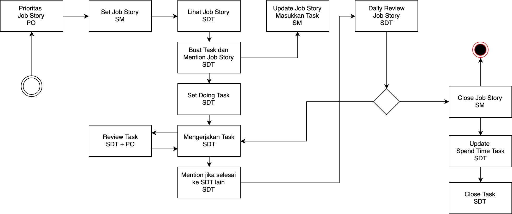

# Handbook

Development handbook

## Process Development

1. ID - In Depth Interview
2. CC - Co Creation
3. DS - Design Sprint
4. [TA - Technical Analysis](development-phase/technical-analysis.md)
5. SS - Scrum Sprint
6. UT - Usability Testing

## Pengetahuan Umum

### 1. GitLab

### 2. Markdown Syntaks

Merupan sintaks yang pada umumnya digunakan di kalangan software development, penggunaan syntaks
biasanya di implementasikan pada issue, wiki maupun komentar pada software development tools tersebut.
Karena sifatnya yang ringan dan mudah dipelajari sintaks penulisan ini sangat digemari dalam dunia
industri software development untuk melakukan formating penulisan dokumen

> **Notes**
> 
> 1. Penjelasan Video : https://www.youtube.com/watch?v=9V1sXiFUHVI
> 2. Link referensi belajar : https://www.markdownguide.org/
> 3. Ebook : https://www.markdownguide.org/book

## Scrum Flow

Proses development di Labtek Indie dilakukan secara transparan, terbuka dan auditable. Kami telah 
menggunakan berbagai macam tool dan skema dalam proses development, namun pada akhirnya sampailah
dalam sebuah titik yang saat ini kami jadikan acuan dalam proses development.

Flow development yang kami gunakan dalam melakukan development di Labtek Indie. 

Penjelasan besar terkait dengan scrum flow kami bisa dilihat di video link berikut ini:

> **Youtube**
>
> https://www.youtube.com/watch?v=h-Wey0vGT7M

Flow dimulai dari:

### 1. Prioritas Job Story : 

Product Owner melakukan prioritas terhadap job story yang nantinya 
dikerjakan dalam 1-2 hari dalam masa sprint. Prioritas ini biasanya dilakukan pada saat melakukan 
SPM (Sprint Planning Meeting).

> **Notes**
> 
> 1. Role : Product Owner

### 2. Set Job Story dan Pembagian Pekerjaan: 

Dalam kegiatan set job story, setelah job story di import ke bagian gitlab issue maka proses 
selanjutnya Scrum Master menyusun jadwal terkait dengan job story yang nantinya akan dijadikan todo 
dalam 2 hari kedepan. 

Tentunya penyusunan jadwal job story juga sudah di set juga tim SDT (scrum development team) nya yang 
ditugaskan untuk mengerjakan job story tersebut.

> **Notes**
> 
> 1. Role : Scrum Master
> 2. Penjelasan Video : https://www.youtube.com/watch?v=wcYQD1T5_LY

### 3. Lihat Job Story, Buat Task dan Mention Job Story

Merupakan proses kelanjutan dari hasil pembagian tim SDT dari proses pembagaian pekerjaan, tim SDT
yang diberi tanggung jawab untuk mengerjakan job story yang ditunjuk wajib untuk membuat task masing-
masing sesuai dengan role dan scope acceptance criteria yang ada.

Sebelum membuat task, lakukan konfirmasi kepada Product Owner :

1. Apakah sudah clear acceptance criterianya?
2. Apakah ada concern lain terkait dengan job story ini?
3. Job story mana yang sekiranya terkait dengan job story ini?
4. Apabila ada usulan dari kamu, kira2 dari product owner memiliki tanggapan bagaimana? 

Apabila sudah clear dan SDT yang ditunjuk maka bisa dimulai untuk proses pembuatan tasknya.

> **Notes**
> 
> 1. Role : SDT yang ditunjuk
> 2. Penjelasan Video : https://www.youtube.com/watch?v=idBD3_4QIac

### 4. Set Doing Task Status, Mengerjakan Task, Set Review Task Status

Sebelum mengerjakan task, maka status task yang ada pada gitlab issue harus dirubah yang tadinya 
belum memiliki label dirubah menjadi `doing`. Fungsinya untuk memberikan informasi bahwa task ini 
sedang dalam proses pengerjaan.

Selanjutnya tim SDT melakukan pengerjaan task sesuai dengan role masing-masing.

Untuk task yang dinyatakan selesai dikerjakan oleh tim SDT maka rubahlah status task tersebut menjadi
`review` sehingga tasknya klo dilihat oleh tim SDT lain task yang bersangkutan statusnya sudah siap
untuk di review oleh SDT maupun Product Ownernya.

Langkah mudah agar dapat notice dari SDT lain adalah dengan melakukan mention ada comment di task, 
setiap SDT yang di mention wajib memberikan tanggapan terhadap apa yang ditanyakan oleh orang yang 
melakukan mention.

Ada alasan kenapa menggunakan metode seperti ini, ini sebenarnya merupakan bagian dari review. Apabila
sudah dilakukan review dalam prosesnya maka pada saat melakukan daily review untuk tingkat koreksinya
pun dapat di minimalisir seminim mungkin.

> **Notes**
> 
> 1. Role : Product Owner dan SDT
> 2. Penjelasan Video : https://www.youtube.com/watch?v=2EllHn0Nrlk

### 5. Update Task Job Story

Ketika tim SDT selesai membuat task, maka akan ada history commentar yang memention terhadap job 
story yang di mention. Merupakan tugas scrum master untuk melakukan update informasi task pada 
bagian description sehingga informasi secara keseluruhan terkait dengan job story dapat di capture 
dengan lengkap.

> **Notes**
> 
> 1. Role : Scrum Master
> 2. Penjelasan Video : https://www.youtube.com/watch?v=eXHvYI2P1W4

### 6. Daily Review

Merupakan langkah untuk mengecek job story apa yang sudah selesai, tentunya ini sesuai dengan point
nomor [2 - set prioritas job story](#scrum-2)

> **Notes**
> 
> 1. Role : Product Owner, Scrum Master dan SDT
> 2. Penjelasan Video : https://www.youtube.com/watch?v=PYupHFztY5A

### 7. Close Job Story

Apabila dinyatak selesai maka, job story bisa di close oleh scrum master dengan sepengatuan product
ownernya.

> **Notes**
> 
> 1. Role : Scrum Master sepengetahuan Product Owner
> 2. Penjelasan Video : https://www.youtube.com/watch?v=qd4whZ7iCS8

### 8. Spend Time dan Close Task

Merupakan kegiatan terkahir untuk melakukan closing task dan update spend time

> **Notes**
> 
> 1. Role : SDT
> 2. Penjelasan Video : https://www.youtube.com/watch?v=NNtqAZEFyMQ