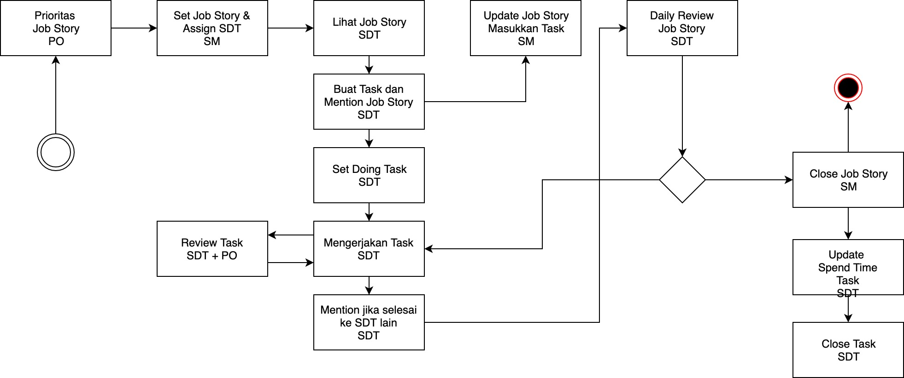

# Handbook

Development handbook

## Scrum Flow

Merupakan flow yang kami gunakan dalam melakukan development di Labtek Indie. 

Penjelasan besar terkait dengan scrum flow kami bisa dilihat di video link berikut ini:

> **Youtube**
>
> https://www.youtube.com/watch?v=h-Wey0vGT7M

Flow dimulai dari:

### 1. Prioritas Job Story : 

Product Owner melakukan prioritas terhadap job story yang nantinya 
dikerjakan dalam 1-2 hari dalam masa sprint. Prioritas ini biasanya dilakukan pada saat melakukan 
SPM (Sprint Planning Meeting).

### 2. Set Job Story : 

Dalam kegiatan set job story, setelah job story di import ke bagian gitlab issue maka proses selanjutnya
Scrum Master menyusun jadwal terkait dengan job story yang nantinya akan dijadikan todo dalam 2 hari kedepan. 

Tentunya penyusunan jadwal job story juga sudah di set juga tim SDT (scrum development team) nya yang 
ditugaskan untuk mengerjakan job story tersebut.

> **Youtube**
>
> https://www.youtube.com/watch?v=h-Wey0vGT7M