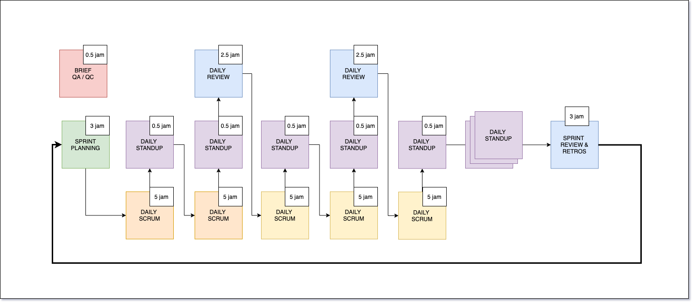
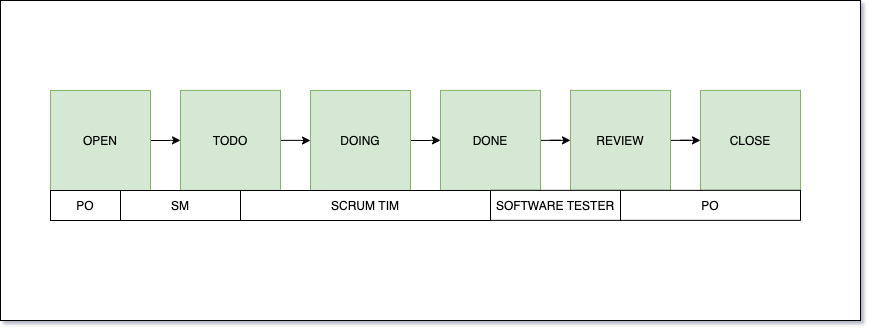
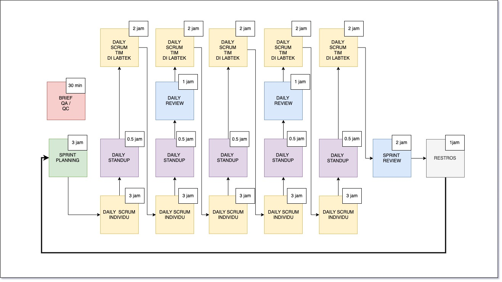

# Getting Started

## Scrum Sprint Overview

Pada dasarnya tidak ada yang membedakan proses scrum sprint dengan scrum sprint pada umumnya, namun di setiap 2-3 hari 
perlu melakukan daily review sebagai suatu cara apakah yang sudah dikerjakan itu sudah sesuai dengan bayangan Product Owner
apa tidak, dengan metode seperti ini kita bisa:

- melakukan kroscek di tengah sprint terkait dengan kualitas produk yang dihasilkan
- masih ada waktu untuk perbaikan di tengah sprint apabila dalam daily review tersebut masih terdapat ketidak sesuaian

Detail untuk masing-masing kegiatan bisa dilihat pada link berikut ini:

* [Kick Off Meeting](kickoffmeeting.md)
* [Sprint Planning](sprint-planning-meeting.md)
* [Daily Scrum](daily-scrum.md)
* [Daily Scrum](daily-scrum.md)
* [Sprint Review Meeting](sprint-review-meeting.md)
* [Restrospective Meeting](retrospective-meeting.md)

## Product Owner

- Seaktif mungkin untuk menanyakan progress pekerjaan sampai sejauh mana kepada scrum tim melalui scrum master
- Sekomunikatif mungkin untuk menyampaikan pertanyaan-pertanyaan yang berasal dari scrum tim untuk disampaikan kepada client
  guna memperoleh perspektif bisnis dari kacamata client
- Proses SPM adalah proses terjadinya negosiasi jumlah product backlog yang akan diambil dan disepakati secara bersama
  oleh scrum sprint untuk di kerjakan dalam satu sprintnya. Sudah barang tentu akan ada kemungkinan jumlah product backlog
  tidak akan terbawa semua pada saat satu sprint berlangsung. 
- Setelah proses SPM selesai lakukan komunikasi kepada client terkait dengan kesepakatan jumlah job story yang nantinya akan 
  dikerjakan
- Melakukan observasi dengan bantuan scrum master di tengah sprint, apakah jumlah job story yang dikerjakan masih dalam 
  waktu yang direncakan apa tidak. Apabila ada kendala yang menyebabkan proses deliveri tidak lancar maka perlu di telusuri
  apa yang menyebabkan kendalan tersebut untuk dicatat dan disampaikan kepada client
- Melakukan meeting dengan client terkait dengan apa yang sudah dicapai dalam tengah sprint guna untuk melakukan penyamaan 
  ekspektasi kembali dengan bahan point di atas tadi

## Scrum Master

- untuk memandu pelaksanaan SPM sesuai dengan yang ada di handbook
- diperjelas dan di pertegas untuk pendistribusian dan tim yang mengerjakan
- sedapat mungkin untuk segera memfasilitasi mencari solusi pada saat melakukan daily standup
- sebelum memulai daily standup, tolong melakukan check ketersediaan scrum development tim apakah sudah lengkap
- mengawali kegiatan dengan melakukan checkin untuk masing-masing invidu, agar dapat mencairkan suasana
- akan ada dokumen yang perlu dilengkapi setelah sprint berlangsung dengan mengacu https://docs.google.com/document/d/1vHlGLw88ateEeP41mcWdbFFw-ig7YlfKLnlCL2Atrm4/edit?usp=sharing

## Flow Kanban

Berikut ini adalah flow kanban dalam pelaksanaan scrum sprint / design sprint, dengan masing-masing status phase
memiliki peran penting untuk melakukan solving problem.

- Open : 
  - ini merupakan issue yang ditulis oleh PO
- Todo :
  - wewenang scrum master untuk memprioritaskan backlog dan memindahkan backlog ke status ini
  - SM memastikan antrian todo maksimal 5-6 task dalam satu board list
  - SM melakukan assignment terhadap antrian todo yang di masukkan
- Doing : 
  - wewenang developer untuk memindahkan backlog **doing** 
  - developer silahkan mengambil task yang berada pada TODO 
  - apabila saat ini sedang mengerjakan ke DOING dan 
  - membuat branch pada lokal branch, satu branch itu adalah satu issue jika developer lebih dari satu
    maka tetap menggunakan satu branch tersebut
  - memindahkannya ke DONE apabila task tersebut sudah selesai di selesaikan
- Done :
  - wewenang developer untuk memindahkan backlog **done**
  - software tester akan melakukan testing terhadap task yang sudah selesai dikerjakan oleh
    developer 
  - tuliskan skenario testing dengan cara melakukan *edit* pada issue gitlab
  - apabila belum DONE tolong langsung geser ke bagian TODO
  - dan apabila belum done tolong di komunikasikan ke SM terkait issue yang belum selesai tersebut
    screenshoot sangat dibutuhkan
  - lead engineer silahkan langsung merge pull request yang dibuat    
- Review :
  - wewenang software tester untuk memnindahkan backlog **review** 
  - setiap 2 atau 3 hari kita akan melakukan review terhadap issue yang ada di sini, atau sesuai dengan kesepakatan
  - developer silahkan melakukan presentasi terkait dengan hasil yang sudah dicapai dengan maksimal
    waktu presentasi adalah 2 jam kepada product owner
  - apabila sudah sesuai maka silahkan close issue tersebut, jika belum sesuai maka silahkan di set ke 
    TODO kembali
- Closed :
  - Closed

## Komunikasi

- Usahakan menggunakan slack untuk day to day komunikasinya
- Apabila ada kendala terkait pengerjaan langsung saja lempar pertanyaan di slack, dan tolong usahakan
  mention ke orang yang ingin anda ajak berbicara
- Tolong scrum master selalui aware terkait dengan pertanyaan yang mungkin tertelan
- Sebisa mungkin datanglah tepat waktu sesuai dengan kesepekatan bersama, apabila berhalangan untuk 
  tidak tepat waktu maka sebisa mungkin untuk menginformasikan keterlambatannya kepada scrum master
  karena ini sangat merugikan orang lain karena harus menunggu kehadiran orang yang pada telat dengan batas waktu 
  3 jam sebelum pelaksanaan daily standup

## Tips

- Untuk scrum tim, apabila sudah menemui jalan buntu. Maksimal untuk mencari solusi pribadi adalah 1 (satu) jam, apabila
  sudah mencari dan tidak menemukan solusinya harap segera berkabar ke slack
- Jangan hanya menunggu daily standup untuk saling berkomunikasi, gunakan waktu sebelum daily standup untuk saling
  berkomunikasi dan bertukar pikiran
- Apabila ada product backlog yang masing kurang jelas, langsung saja tanya ke tim maupun ke product owner
- Terkait dengan teknologi/tool yang dipakai, usahakan untuk melakukan diskusi kepada tim

## Mekanisme Development

- Silahkan di bahas oleh scrum tim

<!-- 
## Gambaran Umum Proses kerja

Pelaksanaan scrum di Labtek Indie secara garis besar dapat dilihat pada gambar dibawah ini:

* [Kick Off dan Sprint Planning](sprint-planning-meeting.md)
* [Daily Scrum](daily-scrum.md)
* [Daily Scrum](daily-scrum.md)
* [Sprint Review Meeting](sprint-review-meeting.md)
* [Restrospective Meeting](retrospective-meeting.md)

Draft

- Komunikasi
- Sadar Diri
- Kolaborasi
- Validasi -->