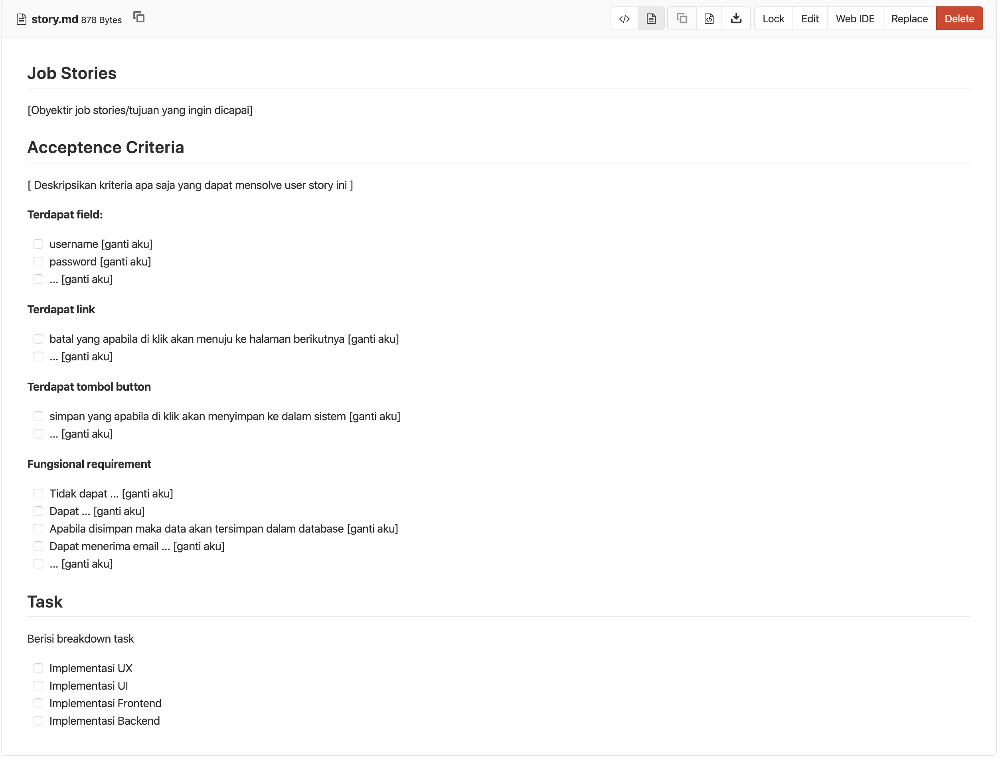

# Daily Sprint

Merupakan kegiatan proses pengerjaan software development oleh scrumt development tim


## Pre Daily Sprint

Sebelum mulai mengerjakan job story:

**Designer**

- Pastikan title dan acceptance criteria pada job story sudah jelas, hal ini bisa dilakukan dengan
  mengkonfirmasi product owner tentang apa yang nantinya dikerjakan
- Usahakan membuat low fidelity prototipe terlebih dahulu sebelum di tuangkan dalam format digital.
  Bahan untuk membuat low fidelity prototipe bisa di ambil https://sneakpeekit.com/. (bisa menggunakan
  fasilitas kantor untuk mencetak sketch)
- Proses pembuatan low fidelity prototipe akan lebih baik di ikuti oleh seluruh tim dalam satu projek
  tersebut, dengan cara ini semua orang dapat memahami dalam satu minggu ke depan punya gambaran tentang
  apa yang nantinya dikerjakan

**Developer**

- Pastikan design sesuai dengan job story sudah di attach pada GitLab issue yang bersangkutan
- Pastikan title dan acceptance criteria pada job story sudah jelas, hal ini bisa dilakukan dengan
  mengkonfirmasi product owner tentang apa yang nantinya dikerjakan
- Tanyakan kepada Product Owner apakah ada fungsional requirement diluar acceptance criteria yang 
  telah di tulis pada job storynya
- Frontend dan Backend melakukan analisis terhadap data dan informasi apa saja yang dibutuhkan untuk
  menyelesaikan job story, analisa bisa berupa:
  - backend perlu memberikan data yang dapat di konsumsi oleh frontend
  - frontend perlu menyiapkan asset dan map data yang di berikan oleh backend
- Kolaborasi antara backend dan frontend dapat ditulis melalui media dokumentasi API pada comment job
  story atau menggukan PostMan

**Job Story**

| Template Job Story | Gitlab New Issue |
| ------------------ | ---------------- |
|  |  |

Sebisa mungkin acceptance criteria pada job story dibuat lebih detail guna memudahkan tim untuk
menterjemahkan sesuai dengan role masing-masing. Setidaknya acceptance kriteria pada job story memililiki
komponen sebagai berikut :

- Terdapat field : menjelaskan field-field apa saja yang dibutuhkan (username, password)
- Terdapat link : menjelaskan link-link apa saja yang dibutuhkan (link cancel, link pagination)
- Terdapat tombol button : menjelaskan button apa saja yang dibutuhkan (button simpan, edit, hapus)
- Fungsional requirement : menjelaskan bagaimana behaviour sistem yang seharusnya berjalan


## Daily Sprint

**Rambu - Rambu**

- 5 jam / hari untuk untuk pengerjaan kegiatan masing-masing individu dalam daily scrum
  - Bisa koordinasi/diskusi ke masing-masing individu
  - Mengerjakan task
- wajib 1 jam / hari  (jam 12 - 13 siang) - wajib untuk melakukan interaksi kepada orang lain dalam 
  daily scrum di SLACK
- mengerjakan task sesuai dengan prioritas due date
- Wajib menggunakan SLACK  dalam berinteraksi tidak ada jalur chat lain

**Developer**

- Menggunakan single branch `master` untuk target merge request
- Wajib menggunakan merge request untuk agar developer lain bisa melakukan review. 

## Daily Standup

**Waktu dan Tempat**

Setelah pelaksanaan daily sprint dilakukan selama 30 menit

**Peserta**

- Product Owner
- Scrum Master
- Scrum Development Team

**Agenda**

- 10 menit : Checkin di buka oleh Scrum Master
- 5 menit : Scrum Master memberikan ruang untuk masing-masing SDT mengisi format pelaporan, apabila 
  sudah selesai semua masing-masing SDT diminta untuk megirimkan format pelaporan tersebut kepada 
  Scrum Master menggunakan slack
- 5 menit : Scrum Master memulai daily standup
- 5 menit : Masing-masing SDT melakukan update terkait dengan daily sprint yang sudah dilakukan
- 5 menit : Scrum Master menutup kegiatan

**Format pelaporan**

Gunakan format ini untuk mengumpulkan informasi yang disampaikan oleh SDT pada saat daily standup,
format pengisian did, will do dan obstacle harus memenuhi kriteria sebagai berikut:

1. Menyebutkan nama job story yang sedang dikerjakan
2. 

```
Nama    :
Tanggal : YYYY-MM-DD
Spent   : ... jam

**Did**

- Menyelesaikan S80 Input data perumahan
- Menyelesaikan S70 Slicing layout input data perumahan

**Will Do**

- Mengerjakan S30 untuk form registrasi
-

**Obstacle**

- Dokumentasi kurang lengkap
-
```

## Daily Review

Dilakukan minimal setiap 2 (hari sekali) pada saat daily scrum berjalan. Hal-hal yang nantinya akan 
dilakukan pada saat daily scrum yakni:

**Peserta**

- QA/QC
- Product Owner
- Scrum Master
- Scrum Development TIm

**Agenda**

- Scrum Master memastikan semua tim hadir dalam setiap daily review
- Scrum Master memberikan overview terkait job story yang nantinya akan di review
- Product Owner mempresentasikan hasil yang sudah dicapai selama tenggang waktu 2 hari tersebut kepada
  QA/QC untuk dilakukan review berdasarkan acceptance criteria dan profesional opinion 
- Scrum Master mencatat masukan yang diberikan oleh QA/QC untuk ditindaklanjuti oleh tim

Untuk itu seluruh tim wajib memastikan pekerjaan job story yang akan direview harus:

- SDT mengerjakan job story sesuai acceptance criteria
- Scrum Master memastikan tentang deliverabilitas sesuai dengan perencanaan sewaktu SPM dapat di
  implementasikan
- Product Owner memastikan hasil pekerjaan yang di kerjakan oleh tim SDT sudah sesuai dengan acceptance
  criteria

## Checklist Scrum Master

- Memastikan seluruh tim ikut hadir dalam proses daily standup dan daily review
- Selalu menampilkan burdown chart pada saat akan melakukan daily standup untuk dijadikan tension
  oleh seluruh tim
- Mencatat format daily standup yang dilaporkan oleh tim ke dalam format airtable setelah tim melakukan
  report daily standup
- Membuat catatan meeting terkait apa yang sudah dicapai hari ini dan mempostingnya ke dalam slack channel

## Checklist Product Owner

- Menerima catatan meeting dari scrum master
- Menginformasikan hasil meeting kepada client terkait jumlah product backlog yang di ambil sesuai 
  dengan laporan dari scrum master
- Harus aktif dan merasakan apa yang di deliver oleh tim itu sudah sesuai dengan tujuan yang ingin 
  di capai (tidak boleh punya perasaan ngak enak)