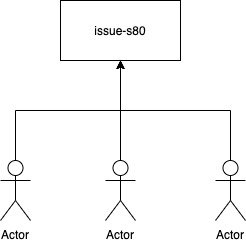
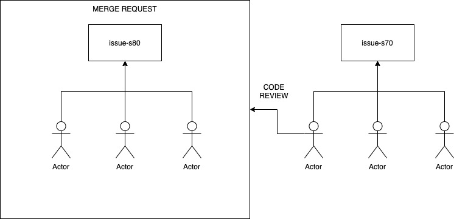

# Developer Guide

Selamat datang pada handbook developer Guide. Dalam dokumen ini akan mengupas panduan developer untuk
memulai pekerjaan proyek kami. Pada saat development kami menggunakan [GitLab](https://gitlab.com) 
sebagai source git management.

## Git Workflow

**Job Story**

- Setiap feature yang dikerjakan berdasarkan gitlab issue yang merupakan sebuah job story yang harus 
  diselesaikan oleh scrum development tim. Masing-masing job story memiliki acceptance criteria.
- Tim akan di tugaskan oleh scrum master untuk mengerjakan fitur sesuai dengan job story yang sudah di
  bebankan kepadanya.
- Job story harus diselesaikan sesuai dengan rencana deliveri pada saat melakukan Sprint Planning Metting

**Merge Request**

- Tim SDT yang di beri beban untuk mengerjakan job story langsung membuat branch sesuai dengan nama issuenya.
- Masing-masing SDT saling berkolaborasi untuk menyelesaikan acceptance criteria dan design yang di 
  lampirkan pada gitlab issue.
- Apabila SDT sudah menyelesaikan fitur yang bersangkutan, salah satu dari tim yang mengerjakan issue
  membuat merge request untuk direview oleh orang lain.

**Code Review**

Code review terjadi pada saat developer membuat merge request dengan dimaksudkan untuk memberikan 
masukan terhadap code yang ditulis apakah:

- Memiliki bug yang dapat menyebabkan masalah yang muncul dengan fitur yang lain
- Code yang ditulis apakah masih bisa di optimasi lagi
- Apakah code yang ditulis sudah menyelesaikan acceptance criteria sesuai dengan job storynya
- Apakah asset yang dicommit sudah memenuhi standard asset apa tidak (khususnya frontend developer 
  harus melakukan kompresi image terlebih dahulu dengan menggunakan https://tinyjpg.com)

Code review ini wajib dilakukan oleh tim yang saat ini secara bersama-sama mengerjakan project.

**GitLab Pipeline**

Setiap project yang dikerjakan secara default akan memiliki proses Continuous Integrasi dan Continous
Delivery (CI/CD) yang meliputi:

- Unit Test
- Linting
- SAST
- Deploy

Proses ini menggunakan GitLab CI Pipeline yang secara otomatis tereksekusi ketika terjadi perubahab
code yang terdapat pada GitLab project baik di branch master maupun di branch yang lain.

## Text Editor

Developer memiliki banyak opsi untuk menentukan text editor yang baik untuk proses
development yang pas untuk diri sendiri, namun ada kalanya text editor yang saat ini
dipakai belum tentu akan pas untuk workflow dalam sebuah tim yang bekerja secara 
bersamaan.

- [Visual Studio Code](https://code.visualstudio.com/)
- [Sublime Text](https://www.sublimetext.com/)
- [Atom](https://atom.io/)

> Kami merekemondasikan untuk menggunakan visual studio code untuk daily proses develpment

## Plugins Text Editor

Untuk memudahkan dalam proses development setiap developer wajib melakukan instalasi plugins yang kami
list pada berikut ini:

- [DotENV Syntax Higlighting](https://marketplace.visualstudio.com/items?itemName=mikestead.dotenv)
- [Docker Syntax Higlighting](https://marketplace.visualstudio.com/items?itemName=ms-azuretools.vscode-docker)
- [EditorConfig](https://marketplace.visualstudio.com/items?itemName=EditorConfig.EditorConfig)
- [Eslint](https://marketplace.visualstudio.com/items?itemName=dbaeumer.vscode-eslint)
- [Import Cost](https://marketplace.visualstudio.com/items?itemName=wix.vscode-import-cost)
- [Prettier](https://marketplace.visualstudio.com/items?itemName=esbenp.prettier-vscode)
- [Auto Rename Tag](https://marketplace.visualstudio.com/items?itemName=formulahendry.auto-rename-tag)

## Coding Standard

Setiap code yang ditulis harus menggunakan coding standard yang kami terapkan pada setiap projectnya

- [PHP Standards Recommendations](https://www.php-fig.org/psr/) merupakan standard yang kami gunakan 
  untuk project yang menggunakan PHP
- Eslint Airbnb dan Eslint Standard merupakan coding standard yang kami gunakan untuk project yang 
  menggunakan JavaScript

## Unit Test

Sebagai control untuk project yang dideliveri maka dengan sepatutnya code yang dibuat harus dapat di 
test menggunakan unit test. Di lingkungan production web apps kami menggunakan teknologi:

- PHP : Laravel
- Node.js : Adonis

## Git 

- [Git Rebase](https://dev.to/shosta/the-git-rebase-workflow-2g49)