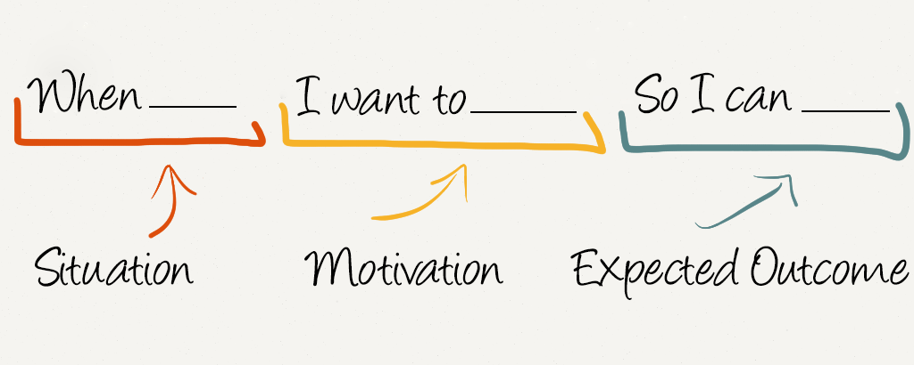

# Product Owner Guide

Dokumen ini menjelaskan tentang panduan seorang product owner pada saat kegiatan scrum sprint maupun 
design sprint yang dilakukan.

## Job Story




Penulisan job story harus mengikuti format sebagai berikut:

```md
## Short Title

[Short title job story]

## Deskripsi

Ketika [isi situasi user], aku ingin [motivasi user], sehingga aku [value yang di dapat]

## Acceptence Criteria

**Fungsional requirement**

- [ ] Tidak dapat ...  [ganti aku]
- [ ] Dapat ...  [ganti aku]
- [ ] Apabila disimpan maka data akan tersimpan dalam database  [ganti aku]
- [ ] Dapat menerima email ... [ganti aku]

**Terdapat field atau informasi:**

- [ ] username [ganti aku]
- [ ] password  [ganti aku]
- [ ] ... [ganti aku]

**Terdapat link**

- [ ] terdapat link batal, yang apabila di klik akan menuju ke halaman berikutnya  [ganti aku]
- [ ] ... [ganti aku]

**Terdapat tombol button**

- [ ] simpan yang apabila di klik akan menyimpan ke dalam sistem  [ganti aku]
- [ ] ... [ganti aku]
```

Format di atas dijelasan pada point-point berikut ini:

- **Short title**, menjelaskan nama job story secara singkat pada umumnya terdiri dari feature yang 
  di inginkan dan memiliki jumlah batas maksimum karakternya yakni sebesar 30 karakter.
- **Deskripsi**, dituliskan dalam menggunakan format job story sehingga 
