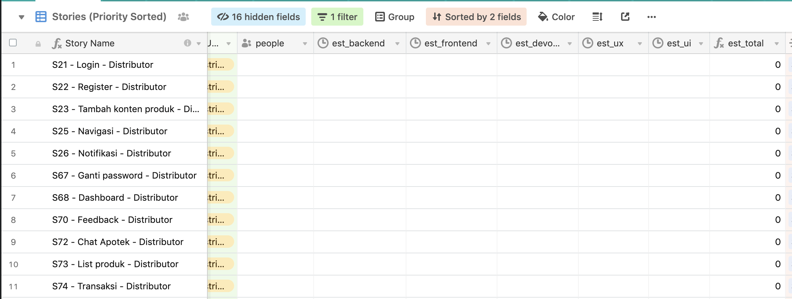

# Sprint Planning Meeting

Merupakan kegiatan untuk menyusun perencanaan sebelum melaksanakan proses development baik itu design
sprint maupun scrum sprint.

## Waktu

- 1 hari sebelum proses scrum sprint atau design sprint dengan durasi 3 jam

## Bahan

- User journey/flow chart sistem yang ada dalam gambararan PIC / Product Owner sehingga nantinya memudahkan tim 
  development menyusun roadmap strategi development
- Product backlog yang akan di lakukan proses development

## Peserta

- Product Owner
- Scrum Master
- Scrum Development Team
- QA / QC Labtek Indie

## Agenda

Yang dilakukan pada sprint planning meting tergambar pada skema berikut ini:

- 30 menit Brief awal dari tim QA/QC
- 60 menit penyampaian product backlog yang nantinya akan dikerjakan oleh **product owner**, apabila 
  diperlukan SDT dapat menggunakan alokasi waktu untuk menanyakan lebih detauk terkait dengan 
  product backlog.
- 30 menit untuk melakukan estimasi waktu pengerjaan dari masing-masing job story (terdiri dari UX
  UI, Frontend, Backend) dilakukan oleh **scrum development tim**
- 15 menit untuk melakukan kalkulasi kesulurahan jumlah man hour dilakukan oleh **scrum master**
- 15 menit untuk melakukan negosiasi terkait dengan product backlog dilakukan oleh 
  **scrum development tim** kepada **product owner**
- 15 Pembagian orang yang ditugaskan untuk mengerjakan oleh SM
- 45 menit untuk melakukan dikusi teknis mekanisme pengerjaan oleh tim yang bisa digunakan untuk
  - membuat sitemap dan flow aplikiasi secara keseluruhan dalam bentuk low fidelity prototype sebagai
    panduan kasar untuk setiap orang yang nantinya
  - menentukan tools dan software yang nantinya digunakan
  - menentukan plan dalam job story yang nantinya akan di deliver per harinya

## Estimasi Kasar

- Pada saat melakukan kegiatan estimasi waktu pengerjaan, estimas di kelompokkan sesuai dengan role 
  masing-masing dalam hal ini (UX, UI, Frontend, Backend)
- Dapat menggunakan excel atau menggunakan airtable project

## Negosiasi Product Backlog

- Gunakan data estimasi kasar tersebut untuk melakukan estimasi terkait dengan product backlog yang 
  akan dikerjakan selama sprint yang nantinya dikerjakan
- 1 (satu) Sprint terdiri dari 10 hari kerja untuk scrum sprint dan 5 hari kerja untuk design sprint
- Masing-masing individu memiliki kontrak jam kerja minimal 5 (lima) jam untuk setiap harinya selama 
  proses scrum berlangsung

## Artefact

- Terdapat estimasi pengerjaan pada masing-masing job story per role (UI, UX, Frontend, Backend)
- Terdapat estimasi total pengerjain pada masing-masing job story
- Terdapat job story yang akan dikerjakan selama sprint yang nantinya akan dilakukan
- Terdapat job story asssigment (siapa yang mengerjakan apa)
- Terdapat job story yang di prioritaskan untuk di selesaikan dalam waktu dekat, semissal dalam 
  waktu 2 (dua) hari kedepan sudah terdapat 2 job story yang sudah selesai maka itu menjadi sebuah 
  tension kepada tim SDT untuk di selesaikan secara tepat waktu
- Boleh juga klo mau spam foto di slack channel :-P

## Success Rate

Merupakan laporan dalam bentuk tingkat pencapaian backlog yang di rencakanan pada saat melakukan sprint 
planning meeting dengan penyelesaian pada saat scrum sprint berlangsung

Laporan ini di dapat dengan membandingkan berapa banyak backlog/issue yang di sepakati diawal dengan
berapa banyak backlog/issue yang di selesaikan. Laporan ini dapat dilihat secara otomatis pada gitlab
milestone project apabila tim menggunakan gitlab issue sebagai tracking issue managementnya

## Checklist Scrum Master

- Memastikan semua tim hadir dan lengkap untuk menghadiri kick off meeting dan sprint planning meeting
  pada satu tempat.
- Memastikan kegiatan kick off meeting dan sprint planning meeting berjalan sesuai dengan standar
  ketentuan ini
- Membuat ringkasan terkait jumlah product backlog yang nantinya akan di ambil dan mempostingnya di 
  slack channel sehingga seluruh tim tahu dan sadar terkait dengan plan yang sudah direncanakan

## Checklist Product Owner

- Menyampaikan product backlog kepada tim
- Menerima laporan hasil meeting dari scrum master
- Menginformasikan hasil meeting kepada client terkait jumlah product backlog yang di ambil sesuai
  dengan laporan dari scrum master