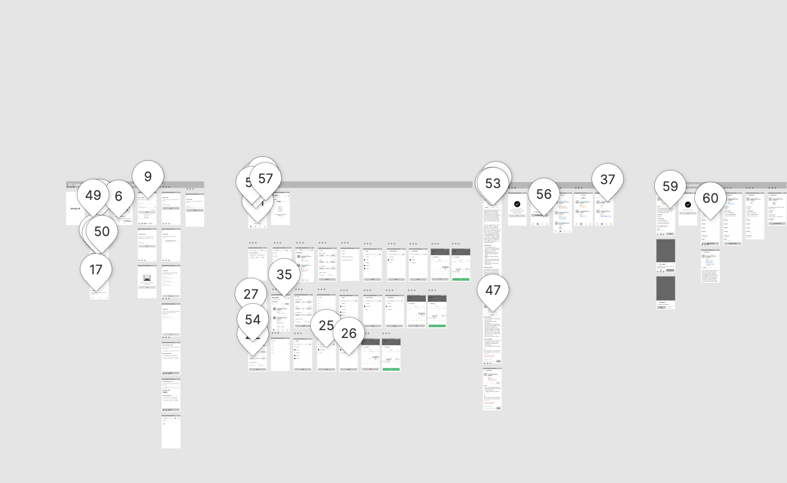

# Collaborative & Issue Management

Hearth of Software Development

---

Materi dapat di unduh di http://bit.ly/2qJ7zlY

---

# Agenda

Membahas secara high level:

- kolaborasi developer dalam melakukan penulisan `source code` perangkat lunak.
- issue management dalam pengembangan proyek perangkat lunak.

---

# About Instructor 

- Adityo Pratomo (Principal Consultant)
- Purwandi (QA / QC)

---

# !!!

- Sudahkah anda **pernah** atau **ikut** mengerjakan proyek perangkat lunak?
- Secara tidak langsung pastinya anda akan mendengar istilah yang tidak umum
  dari kalangan developer bukan?
- Pernahkah kalian memperhatikan apa yang developer lakukan untuk berkolaborasi?

---


---


---


---

# Git & GitLab

---

## Version Control Management

- Dalam pengembangan perangkat lunak tidak akan terlepas dengan penggunakan 
  version control management sistem.
- Karena berbagai permasalahan tadi, maka sangat diperlukan sebuah alat yang 
  membantu tim dalam melakukan:
  - management versi `source code`
  - management tracking history `yang` terakhir melakukan perubahan
  - integrasi antara masing-masing developer

---

## Kenapa Git

- Git merupakan salah satu perangkat lunak untuk melakukan managerial `version`
  terhadap kode program yang ditulis oleh developer.
- Di luar sana banyak sekali version control yang tersedia di antaranya: SVN,
  Mercurial
- Paling populer karena software ini digunakan oleh proyek open source terbesar
  yakni linux kernel
- Dengan menggunakan `git` developer bisa melakukan kolaborasi dalam waktu 
  bersamaan tanpa  perlu khawatir terkait proses integrasi kode program yang 
  ditulis.

---


---

- Gambar di atas menjelaskan secara high level posisi `git` berada
  - git local
  - git server
- `git local` masing-masing komputer developer terdapat perangkat lunak `git`
- `git server` mereka menggunakan `GitHub` sebagai server git untuk 
   melakukan kolaborasi

**

> Notes : 
> Git server bersifat opsional, karena sebenarnya git bisa beroperasi tanpa 
  menggunakan git server

---


---

## Perintah Umum

Secara umum ketika developer melakukan kolaborasi dengan menggunakan git, akan ada istilah 

- `branch` merupakan istilah untuk mengisolasi `source code` untuk memulai pengerjaan perubahan fitur
- `commit` merupakan informasi yang diberikan oleh developer untuk menandai perubahan
   yang dibuat itu di fungsikan untuk apa
- `pull` merupakan perintah untuk mendapatkan perubahan source code yang 
   terupdate dari server git
- `push` merupakan perintah  untuk mengirim perubahan source code ke server git

---

- `merge` merupakan perintah untuk melakukan merge source code dari developer lain
- `merge request` atau `pull request` merupakan istilah untuk meminta developer lain   
   untuk mengaply perubahan source code dari yang telah ia kerjakan

---


---

## GitLab 

- Merupakan salah satu penyedia layanan git server
- Dengan adanya git server developer akan dengan mudah untuk melakukan kolaborasi
- Sama seperti `GitHub` gitlab menyediakan beberapa fitur unggulan seperti : built 
  in CI/CD, management issue dll

---


---

## Praktik

Explore GitLab Interface

- Buat akun GitLab kalau belum memiliki akun
- Masuk ke GitLab
- Navigasi ke contoh project `https://gitlab.com/knods/example-git`
- Mari kita bersama-sama mengeksplorasi halaman GitLab

---

# Markdown

---

## Apa itu Markdown

- Merupakan `markup language` yang sering digunakan di internet yang digunakan untuk
  melakukan formating sebuah dokumen.
- `markup language` adalah bahasa sistem yang digunakan untuk menganotasikan sebuah 
  dokumen dengan sintaks yang sudah distandarkan
- Di perkenalkan pada tahun `2004` oleh	John Gruber https://daringfireball.net/projects/markdown/

---

## Mengapa Markdown

- Penulisan format dengan sintaks yang jelas
- Tidak membutuhkan perangkat lunak tertentu untuk membuat dan mengatur dokumen
  (tidak seperti file `.doc` yang hanya bisa dibuka oleh perangkat lunak word)
- Karena bisa dibuka dengan perangkat lunak biasa, seperti (notepad dll) sehingga
  pengoperasiannya terbilang cepat
- Kekurangan : harus mempelajari sintaks yang digunakan, namun ketika sudah
  mengetahui sintaks penggunaan akan lebih cepat

---

## Markdown Visual

- Online editor : https://dillinger.io/
- App : https://moeditor.js.org/

---

## Markdown Sintaks

Tenang tidak akan susah kok :-), mari sembari praktik

---

## Heading

```md
# Heading 1
## Heading 2
### Heading 3
#### Heading 4
##### Heading 5
```

- Dimulai dengan karakter `#` kemudian ada spasi setelahnya
- Jumlah `#` mengindikasikan untuk paragraph tersebut menggunakan heading berapa

---

## Paragraph

```md
# Paragraph

Tidak ada yang spesial dalam menulis sebuah paragraph di markdown, penulisan 
paragraph seperti nulis text biasa.

Apabila ingin melakukan space antar paragraph satu dengan yang lain tinggal 
memberikan [enter] pada paragraph satu dengan paragrap yang lainnya
```

---

## Emphasis

```md
*Italic* diapit dengan 1 karakter asterik
**Bold** diapit dengan 2 karakter asterik 
_Underscore_ diapit dengan 1 karakter _
~~Strikethrough~~ diapit dengan 2 karakter ~

```

---

## List dan Unorder List

```md
Penulisan list juga sangat lah mudah dengan melakukan secara ekplisit

- List pertama
- List Kedua 
- List Ketiga

* List pertama
* List Kedua 
* List Ketiga

1. List pertama
2. List Kedua 
3. List Ketiga
```

---

## List Nested

```md
1. Ini list awal
  - List nested 1
  - List nested 2
  - List nesed 3
2. Ini list kedua
3. Ini list ke tiga
  - List nested 1
  - List nested 2
  - List nesed 3
```

---

##  Link dan Image

```md

# Dibawah ini merupakan sintaks untuk membuat link, di awali dengan nama link
# kemudian disertai dengan link yang dimaksud
[GitLab Overview](https://gitlab.com)

# atau langsung link
https://gitlab.com

# Hampir sama dengan link, namun untuk image ditambahkan 

```

---

## Code dan Syntaks Highlighting

Di gunakan untuk melakukan highlight terdapat kode program

```js
const AppManager = () => {
  return (
    <React.Fragment>
      <h1>Helllo</h1>
      <div>Hello world</div>
    </React.Fragment>
  )
}
```

---

# Checkbox

Sintaks ini hanya terdapat mada layanan tertentu, karena pada dasarnya sintaks ini 
tidak terdapat pada standar dari markdown itu senditi

```md
- [ ] Hallo ini checkbox yang belum di check
- [ ] Hallo ini checkbox yang belum di check
- [ ] Sedangkan ini markdown yang sudah di check
```

Untuk demo sintaks ini bisa menggunakan GitLab Issue

---

## Cheatsheet

https://github.com/adam-p/markdown-here/wiki/Markdown-Cheatsheet

---
 
# Issue Management

---


---

## Tracking Issue

- Bagaimana kalian melakukan tracking terhadap management proyek perangkat lunak?
- Apakah menggunakan `job story`, `task`, `issue` atau `bug`
- Apakah kalian mengerti dari ketiga buah istilah di atas?

---

## Fakta `Job story` 

Merupakan salah satu **format** yang digunakan untuk memfasilitasi bagaimana cara
berkomunikasi antara client dengan developer. Format ini sering digunakan oleh 
product owner untuk `mentranslate` kebutuhan sistem yang di inginkan oleh client
kepada tim development

---

## Fakta `Task`

Juga merupakan format yang mungkin bisa di standarkan (tergantung dari kebijakan 
dari tim development) yang befungsi untuk mencatat tugas yang mungkin nantinya 
akan dilakukan oleh tim development

---

## Fakta `Bug`

Juga merupakan format yang mungkin bisa di standarkan (tergantung dari kebijakan 
dari tim development) yang befungsi untuk mencatat error bug yang mungkin nantinya 
perlu di solve oleh tim development

---

## Faktanya

- Pada dasarnya apa sih yang kita selesaikan?
- `Job Story`, `Task`, `Bug`, `Epic` klo kita tarik lurus apakah yang membuat entitas
  ini saama?

---

## Issue

- Pada dasarnya semua entitas di atas adalah `masalah` atau `issue` yang harus kita 
  selesaikan.
- Karena ada issue maka issue tersebut harus kita selesaikan
- Yang kemudian di beberapa layanan issue management hal tersebut menjadi dipisah itu merupakan 
  improvisasi dari penawaran fitur untuk memudahkan dalam melakukan tracking issue

---

## Penerapan Issue

Dengan alasan tersebut di beberapa layanana penyedia source code management mereka
hanya menggunakan `issue` sebagai brand untuk untuk melakukan tracking dari masalah
yang mereka hadapi

- https://github.com/twbs/bootstrap/issues
- https://gitlab.com/gitlab-org/gitlab/issues

---

## Karakteristik Issue

- Memiliki tujuan dan manfaat ketika issue itu dibuat
- Hanya memiliki simple state `open` dan `close`
- Satu  issue hanya memiliki **satu** tujuan dan satu manfaat untuk memperkecil skop
- Dapat dilakukan tracking terkait dengan history dari issue:
  - apakah sudah dikerjakan
  - apakah ada kebijakan yang di ambil
  - bisa menyimpan artefak dalam proyek dalam hal ini diskusi

---

## GitLab Issue

Setiap issue yang dibuat pada gitlab akan memiliki beberapa informasi yakni

1. **Judul Issue**, merupakan informasi yang ditulis untuk menjelaskan secara 
  singkat issue tersebut.
2. **Body Description**, merupakan informasi yang ditulis untuk menjelaskan secara 
  detail terkait maksud dan tujuan issue itu dibuat.
3. **Assignment**, merupakan informasi yang dibuat untuk meletakkan siapa yang akan 
  mengerjakan issue ini nantinya
4. **Label**, informasi label
5. **Milestone**, merupakan informasi issue ini akan dikerjakan dalam periode sprint
6. Bobot dan Due Date

---


---

Bentar tadikan ada `job story`, `task`, `issue` atau `bug`, bagaimana caranya
ketika timku nulis 4 buah entitas tersebut bisa sama semua formatnya

---

## Issue Template

Pada GitLab mendukung issue template, issue template ini bisa digunakan untuk
menstandarkan format ketika ada individu menulis sebuah issue dapat dengan mudah
memilih template format yang nantinya digunakan.

Menjadi penting karena dengan menggunakan template kita dapat mengiring apabila
membuat sebuah issue akan mengikuti standar yang sudah dibuat sehingga nantinya 
untuk melakukan tackling issue menjadi lebih mudah.

---


---

## Praktik

1. Masuk ke dashboard project
2. Cek apakah sudah ada folder di dalam `.gitlab/issue_templates`
3. Apabila belum ada silahkan untuk membuat file dengan mengklik tombol `new file`
4. Isikan filename dengan nilai `.gitlab/issue_templates/[nama-template].md` 
   (sesuai dengan nama template yang dikehendaki)
5. Isikan body 
6. Kemudian Save
7. Silahkan buat issue lalu pilih template

---


---


---

# Penerapan di Labtek

- Kami mempercayakan proses development pada freelancer.
- Freelancer yang mengerjakan proyek tidak lah akan selalu sama
- Formating itu perlu kami lakukan untuk menstandarkan format penulisan  informasi sehingga
  siapun yang nantinya bekerja dengan labtek akan memiliki experience yang sama

---

## Formating Story

```md
## Job Stories

[Obyektir job stories/tujuan yang ingin dicapai]

## Acceptence Criteria

**Terdapat field atau informasi:**

- [ ] username [ganti aku]
- [ ] password  [ganti aku]
- [ ] ... [ganti aku]

**Terdapat link**

- [ ] batal yang apabila di klik akan menuju ke halaman berikutnya  [ganti aku]
- [ ] ... [ganti aku]
```

---

```md
**Terdapat tombol button**

- [ ] simpan yang apabila di klik akan menyimpan ke dalam sistem  [ganti aku]
- [ ] ... [ganti aku]

**Fungsional requirement**

- [ ] Tidak dapat ...  [ganti aku]
- [ ] Dapat ...  [ganti aku]
- [ ] Apabila disimpan maka data akan tersimpan dalam database  [ganti aku]
- [ ] Dapat menerima email ... [ganti aku]
- [ ] ... [ganti aku]
```

---

## Formating Bug

```md
## Deskripsi issue

[Tidak bisa melakukan login]

## Behaviour seharusnya

[Saya dapat logn]

## Langkah-langkah kenapa issue ini muncul

1. [Step 1]
2. [Step 2]
3. [Step 4]

## Screenshoot masalah yang terjadi

[Upload screenshoot masalah yang terjadi]
```


---

## Mari Praktik Label

- Membuat issue template yang terdiri dari
  - story
  - bug
- Membuat issue dengan cara memilih template yang tadinya sudah dibuat
- Issue yang dibuat akan mengatasi masalah "Aplikasi Hotel Management System"

---

# Issue Label

- Setelah issue dibuat bagaimana kita melakukan identifikasinya?
- Bagaimana cara kita untuk mengetahui state dari issue yang sudah ada?

---

## Label

Dengan adanya label akan memudahkan kita untuk mengindentifikasi state dari issue 
yang ada, contoh dari list label:
- UI
- UX 
- Backend
- Todo
- Ready to Test
- Review

---


---


---

## Mari Praktik Label

- Membuat label
- Mengupdate issue dengan menambahkan informasi label

---

# Issue Milestone

- Merupakan istilah yang sama dengan sprint
- Memiliki periode waktu yang musti diselesaikan
- Apabila sudah di create nantinya akan menampilkan burn down chart yang nantinya
  bisa dipakai untuk melihat progress ketercapaian dari sebuah proyek

---


---


---


---

## Mari Praktik Milestone

- Membuat Milestone
- Mengupdate issue dengan menambahkan informasi milestone
- Melihat burndown chart

---

# Interaksi Scrum Development

---

## Interaksi Scrum Development

- Yang perlu dilakukan oleh tim development, yakni se-aktif mungkin untuk berkomunikasi menggunakan 
  gitlab issue pada saat proyek berjalan
- Gunakan tools yang tepat di saat yang tepat:
  - gunakan gitlab issue untuk mencatat dan mendiskusikan terkait dengan penyelesaian issue, karena
    segala diskusi yang terdapat pada issue nantinya bisa di track sesuai dengan konteks issuenya
  - gunakan chat untuk melakukan obrolan santai diluar issue

---

- Pastikan maksud dan tujuan dari sebuah issue sudah jelas, terkadang issue yang dibuat dengan
  cara asal, apabila hal tersebut terjadi klarifikasikan kepada orang yang membuat issue
- Gunakan checkbox format dalam pembuatan issue yang nantinya bisa digunakan sebagai checklist
  ketika melakukan daily review maupun user acceptance test
- Ketika memberikan komentar pada gitlab issue, sangat di rekomendasikan untuk melakukan mention
  kepada orang yang sekiranya ikut bertanggung jawab untuk penyelesaian masalah issue tersebut

---

## Ada apa dengan Slack dan Chat Apps Lain ...

- Sebelum adanya slack dan layanan chat room yang lain, semua informasi dan diskusi 
  terkait dengan penyelesaian proyek di lakukan melalui issue sistem
- Kembali lagi pada dasarnya chat room seharusnya menjadi alat untuk melakukan
  diskusi secara santai, bukan dijadikan sebagai diskusi hingga berakhir kepada 
  sebuah pengambilan keputusan dari sebuah masalah
- Apabila hal ini dilakukan maka akan terasa sulit untuk melakukan tracking terhadap
  keputusan yang di ambil pada saat itu, karena karakteristik dari chat tidak
  mengakomodir sebagaimana karakteristik issue

---

# Work flow

- Beda proyek maka akan beda work flownya
- Workflow bisa digunakan untuk memberikan aturan yang jelas state pada masing-masing issue untuk
  menyelesaikan issue ini harus melewati state mana saja. Contoh workflow:
  - todo
  - doing
  - done
- Tim bisa membuat sendiri flow kerjanya, namun pembuatan flow kerja seperti ini harus di sepakati 
  diawal sebelum proyek tersebut dilaksanakan

---

# GitLab Board

GitLab memudahkan kita untuk mengatur workflow sesuai dengan proyek

---


---

## Mari Praktik GitLab Board

Terdapat proyek yang di dalamnya melakukan dua buah pekerjaan design dan development, mari kita lakukan:

- Membuat list GitLab Board
  - todo
  - ready to review
  - ready to develop
  - ready to test
  - review
- Membuat board baru untuk memisahkan flow tim
- Memindahkan issue ke antar list

---

# GitLab Artefak

---

## Pipeline

- Merupakan fitur yang terdapat pada GitLab yang digunakan oleh tim development untuk melakukan
  automatisasi proses integrasi dan deployment pada saat melakukan development (CI/CD)
- Pipeline akan di dijalankan secara otomatis ketika tim development mengupdate perubahan source code
- Perubahan code yang dilakukan oleh development tim biasanya akan terletak pada branch

---

- Untuk memastikan source code tersebut sesuai standar dan dapat dipertanggung jawabkan maka developer
  harus memastikan source code yang di update harus lulus dari pipeline.
- Dalam tools ini dapat mencakup beberapa tahapan, seperti:
  - build  stage : install project dependency
  - testing stage : unit test, linting
  - security check stage : SAST (static analisys security testing)
  - relase stage : release docker image
  - deployment stage : deploy staging dan deploy production

---


---

## Artefak

- Merupakan salah satu output yang dihasilkan dari proses CI/CD pipeline, artefak bisa berupa:
  - file apk
  - file installer
  - atau output tertentu sesuai dengan konfigurasi yang dilakukan
- Artefak dapat di jumpai di halaman pipeline
- Karena pipeline akan ke trigger secara terus menenerus, maka artefak yang terbuat jumlahnya juga 
  mengikuti dari berapa banyak jumlah pipeline
- Tim development dapat mengunduh artefak yang terbuat dengan memperhatikan latest pipeline pada branch
  tertentu

---

## GitLab Design

- Design merupakan salah satu bentuk artefak yang mendukung proyek pengembangan perangkat lunak
- Tools yang digunakan untuk membuat design juga bermacam-macam: sketch, figma, adobe xd
- Untuk melakukan kolaborasi di layanan seperti figma dan adobe xd memiliki fitur untuk melakukan 
  komentar pada layanan tersebut

---



---

## Namun?

- Ketika memberikan comment kita harus melihat kembali AC di tempat yang lain, semisal klo kita
  membuat AC di airtable maka kita juga harus membuat airtable
- Kebijakan menjadi multiple source, karena ketika membuat comment cenderung melihat secara visual
  tanpa melihat AC dalam satu tempat yang utuh
- Tidak ada proses versioning pada design yang sudah dibuat sehingga akan sulit membedakan perubahan
  dari suatu waktu
- Proses development akan menjadi sulit dilakukan, karena design yang di berikan mungkin terjadi
  perubahan di figma. Sementara developer tidak setiap hari melakukan pengecekan

---


---

## GitLab Design

- Merupakan feature yang terdapat pada masing-masing gitlab issue
- Aturannya sangat simple
  - upload design yang sesuai dengan AC
  - apabila sudah tidak digunakan hapuslah design tersebut
  - untuk design yang memiliki revisi, maka upload lah dengan nama file yang sama dengan cara begini
    kita bisa melakukan tracking terhadap revisi

---


---


---


---

# GitLab

- Source code management
- Issue management
- Artefak
- CI CD Pipeline
