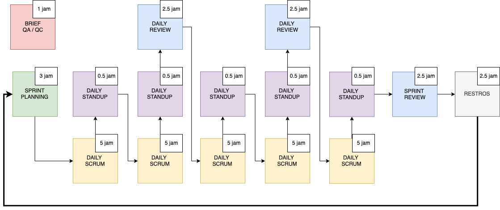

# Overview Sprint Framework

Gambar umum sprint framework yang terdapat pada Labtek Indie

1. Kick Off dan Sprint Planning	: Dilakukan sebelum sprint
2. Daily Scrum		  : Day to day pengerjaan (design/scrum) sprint
3. Daily Standup	  : Update status masing-masing individu
4. Daily Review		  : Dilakukan setiap dua hari sekali untuk review daily
6. Sprint Review	  : Review yang dilakukan di akhir sprint
7. Retrospective	  : Dilakukan setelah sprint review

# Daily Sprint

Merupakan kegiatan proses pengerjaan software development oleh scrumt development tim

## Pre Daily Sprint

**Frontend dan Backend**

Akan lebih baik sebelum pelaksanaan daiy sprint 1 hari sebelumnya terjadi komunikasi yang intens
tentang penyamaan persepsi:
- apa yang di inginkan frontend
- data apa saja yang musti disiapkan oleh backend
- penyamaan persepsi di antara dua role dengan menggunakan dokumentasi API 

**Frontend dan UI Designer**

## Daily Sprint