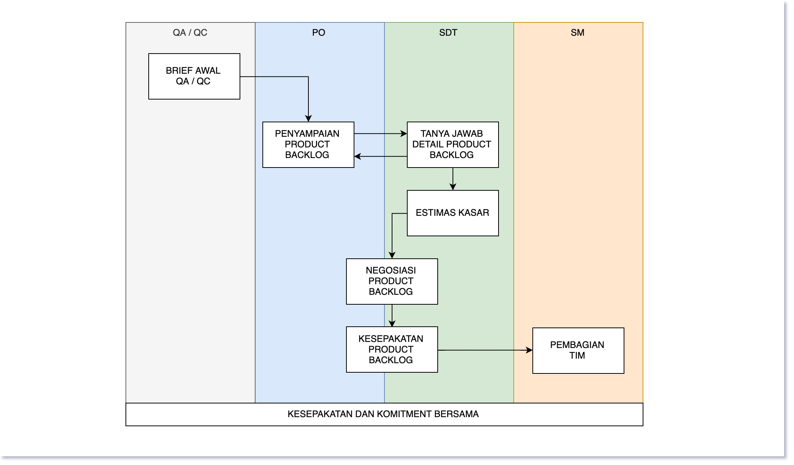
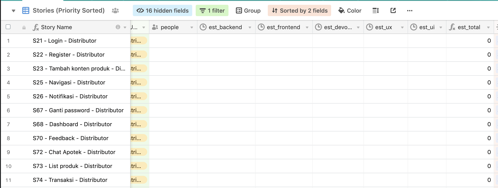

# Sprint Planning Meeting

<small>Terakhir di ubah: 10 Oktober 2019 21:31</small>

Merupakan kegiatan untuk menyusun perencanaan sebelum melaksanakan proses development baik itu design
sprint maupun scrum sprint.

**Rangkaian Kegiatan**

1. [Kick off Meeting](#kick-off-meeting)
2. [Sprint Planning Meeting](#sprint-planning-meeting)
3. Gambaran Umum Scrum Flow

## 1. Kick off Meeting

Merupakan kegiatan yang dilakukan sebelum sprint planning meeting dengan tujuan untuk sebagai temu
awal masing-masing tim

### Waktu

- 1 hari sebelum pelaksanaan scrum planning meeting

### Bahan

- [ ] Product backlog yang akan di lakukan proses development

### Peserta

- [ ] Product Owner
- [ ] Scrum Master
- [ ] Scrum Development Team

### Agenda

- 15 menit : Perkenalan tim SDT secara tatap muka
- 1 jam    : Penjelasan product backlog dari Product Owner kepada Scrum Development Team
- 1 jam    : Diskusi dan tanya jawab terkait product backlog 

Dalam sesi ini tidak ada agenda untuk melakukan proses bergaining dan negosiasi terkait dengan 
jumlah product backlog yang ingin dicapai oleh Product Owner, lakukan proses negosiasi pada saat 
Scrum Planning Meeting

### Tujuan

- Temu awal dengan seluruh tim yang nantinya akan mengerjakan
- Tim memiliki gambaran yang lebih dalam terkait dengan apa yang nantinya akan dikerjakan sebelum
  kegiatan Sprint Planning Meeting dilakukan
- Masih memiliki cukup waktu untuk memikirkan task apa saja yang nantinya akan dikerjakan untuk
  masing-masing job storynya
- Memiliki pemikiran estimasi waktu untuk job story yang nantinya akan di ambil

### Artefact

- Tidak ada artefact untuk kegiatan kick off meeting
- Boleh juga klo mau spam foto di slack channel :-P

## 2. Sprint Planning Meeting

### Waktu

- 1 hari sebelum proses scrum sprint atau design sprint dengan durasi 3 jam

### Bahan

- [ ] Product backlog yang akan di lakukan proses development

### Peserta

- [ ] Product Owner
- [ ] Scrum Master
- [ ] Scrum Development Team
- [ ] QA / QC Labtek Indie

### Agenda

Yang dilakukan pada sprint planning meting tergambar pada skema berikut ini:

1. 30 menit Brief awal dari tim QA/QC
2. 60 menit penyampaian product backlog yang nantinya akan dikerjakan oleh **product owner**, apabila 
   diperlukan SDT dapat menggunakan alokasi waktu untuk menanyakan lebih detauk terkait dengan 
   product backlog.
3. 30 menit untuk melakukan estimasi waktu pengerjaan dari masing-masing job story (terdiri dari UX
   UI, Frontend, Backend) dilakukan oleh **scrum development tim**
4. 15 menit untuk melakukan kalkulasi kesulurahan jumlah man hour dilakukan oleh **scrum master**
5. 15 menit untuk melakukan negosiasi terkait dengan product backlog dilakukan oleh 
   **scrum development tim** kepada **product owner**
6. 15 Pembagian orang yang ditugaskan untuk mengerjakan oleh SM
7. 45 menit untuk melakukan dikusi teknis mekanisme pengerjaan oleh tim

#### Notes

---

**Estimasi Kasar**

1. Pada saat melakukan kegiatan estimasi waktu pengerjaan, estimas di kelompokkan sesuai dengan role 
   masing-masing dalam hal ini (UX, UI, Frontend, Backend)
2. Dapat menggunakan excel atau menggunakan airtable project

**Negosiasi Product Backlog**

1. Gunakan data estimasi kasar tersebut untuk melakukan estimasi terkait dengan product backlog yang 
   akan dikerjakan selama sprint yang nantinya dikerjakan
2. Rambu-rambu untuk proses pengerjaan:
   - 1 (satu) Sprint terdiri dari 10 hari kerja untuk scrum sprint dan 5 hari kerja untuk design sprint
   - Kontrak kerja adalah 
     - 5 jam per hari, 
     - 25 jam per 5 hari dan 
     - 50 jam per 10 hari

### Artefact 

- [ ] Terdapat estimasi pengerjaan pada masing-masing job story per role (UI, UX, Frontend, Backend)
- [ ] Terdapat estimasi total pengerjain pada masing-masing job story
- [ ] Terdapat job story yang akan dikerjakan selama sprint yang nantinya akan dilakukan
- [ ] Terdapat job story asssigment (siapa yang mengerjakan apa)
- [ ] Terdapat job story yang di prioritaskan untuk di selesaikan dalam waktu dekat, semissal dalam 
      waktu 2 (dua) hari kedepan sudah terdapat 2 job story yang sudah selesai maka itu menjadi sebuah 
      tension kepada tim SDT untuk di selesaikan secara tepat waktu
- [ ] Boleh juga klo mau spam foto di slack channel :-P

